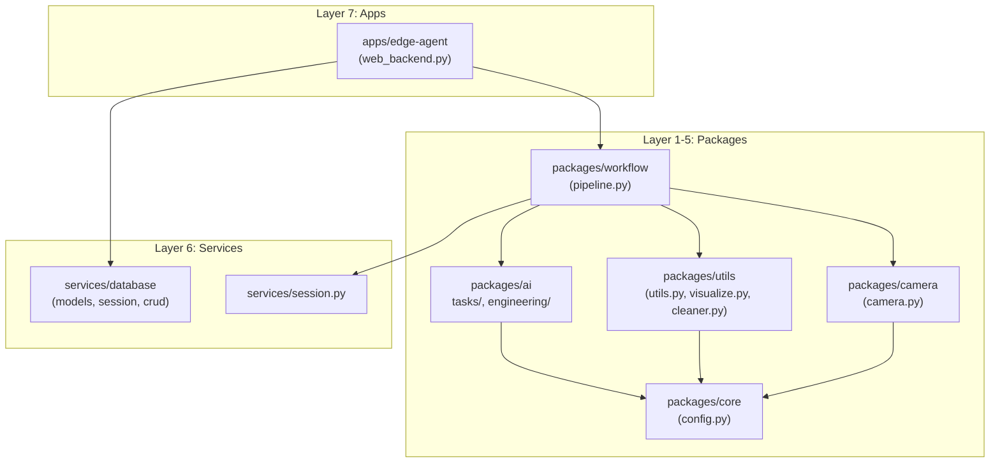

# Tái cấu trúc thành công DAG Monorepo Architecture

Tôi đã hoàn tất việc di chuyển và tái cấu trúc mã nguồn dự án sang kiến trúc 7-layer chuẩn DAG như bạn và Gemini đã đề xuất. Bên cạnh đó, **giai đoạn 2 (Thiết lập Workspace & Scripts)** cũng đã được thực thi thành công.

> [!SUCCESS]
> Kiến trúc mới đã loại bỏ hoàn toàn tình trạng phụ thuộc chéo (circular dependency). Hệ thống giờ đây được thiết kế để dùng chung bằng trình quản lý gói `uv` qua tính năng Workspaces.

## Những thay đổi chính

Dưới đây là sơ đồ cấu trúc mới đã được áp dụng:

### 1. Phân chia rõ ràng các gói (Packages)
- `packages/core/config.py`: Trái tim cấu hình của toàn hệ thống.
- `packages/utils`: Chứa các hàm tiện ích (`utils.py`), xử lý dọn dẹp (`cleaner.py`), và vẽ ảnh (`visualize.py`).
- `packages/camera`: Đóng gói việc xử lý RTSP camera.
- `packages/ai`: Phân tách rạch ròi thành 2 mảng: `tasks/` và `engineering/`.
- `packages/workflow`: Chứa `pipeline.py` (điều phối luồng nghiệp vụ AI).

### 2. Thiết lập `uv` Workspaces (Mới!)
Tôi đã tạo ra mạng lưới `pyproject.toml` cho toàn bộ dự án, gắn kết các thành phần thành các gói (packages) độc lập và có sự phụ thuộc (dependencies) theo chuẩn DAG.
- **Root (`pyproject.toml`)**: Quản lý toàn bộ `packages/*`, `services`, `apps/*`.
- **Thành phần**: Mỗi thành phần con đều có một `pyproject.toml` riêng chỉ định các công cụ nó cần (`opencv-python`, `torch`, `ultralytics`...). Những component nào cần gọi module khác sẽ được khai báo phụ thuộc thông qua `workspace = true`. Ví dụ `packages/workflow` sẽ trỏ về `ai`, `camera`, `utils` và `core`.

### 3. Quy hoạch Scripts chạy tự động (Mới!)
Tôi đã tạo thư mục `scripts/` và tái tạo các file `.bat` thiết yếu:
- `scripts/run_setup_app.bat`: Gọi tự động lệnh `uv venv` và `uv sync` để đồng bộ toàn bộ workspace.
- `scripts/run_web_backend.bat`: Kích hoạt `.venv` và khởi chạy máy chủ FastAPI của edge-agent.
- `scripts/run_main.bat`: Script khởi động mẫu.

> [!WARNING] Về việc đổi tên thư mục gốc
> Hiện tại hệ điều hành có thể đang khóa tiến trình đổi tên thư mục đang mở trong IDE. Tôi khuyên bạn hãy **đóng cửa sổ IDE này lại** và tự tay đổi tên thư mục `1_edge_node` thành `vision-ai-platform` trong File Explorer của Windows.

### 4. Dọn dẹp
- Quá trình kiểm tra không tìm thấy file `pipeline_backup.py`, do đó tôi đã đánh dấu bỏ qua.
- Thư mục `app/` và các file rác gốc (như `web_backend.py` cũ) vẫn đang được giữ lại tạm thời. Khi bạn đã đổi tên folder và chạy lệnh `uv sync` ổn định, bạn có thể xóa toàn bộ file `.py` dư thừa ở bên ngoài và thư mục `app/` cũ.

## Cách kiểm tra

1. Mở thư mục dự án của bạn (sau khi đã đổi tên nếu muốn).
2. Chạy `scripts/run_setup_app.bat` để `uv` tự động cài đặt môi trường ảo và móc nối các package nội bộ.
3. Chạy `scripts/run_web_backend.bat` để thử chạy chương trình theo cấu trúc Lego mới.
