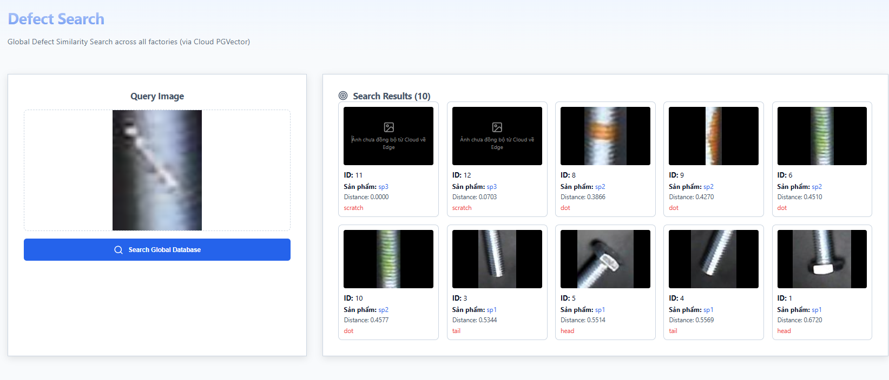
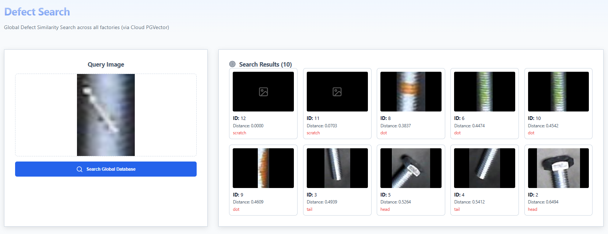

Viewed DefectSearch.tsx:94-129

Câu hỏi của bạn cực kỳ sắc sảo và nó chạm đến chính cốt lõi của kiến trúc **Hybrid (Cloud + Edge)** mà chúng ta vừa xây dựng!

Việc màn hình hiển thị kết quả chữ (ID: 11, 12, ErrorDetail: "scratch") nhưng **lại bị mất hình (đen thui)** chứng tỏ 2 điều vô cùng quan trọng và đúng hoàn toàn với thiết kế của chúng ta:

### 1. Thuật toán Search (Vector Similarity) THỰC SỰ đang chạy trên Cloud Server
Bởi vì bạn **chưa hề đồng bộ** dữ liệu xuống Edge, database SQLite ở Edge hoàn toàn không biết sự tồn tại của lỗi "scratch". Thế nhưng, khi bạn bấm "Search Global Database", UI gọi API `CLOUD_API_URL/search/by-image`. API này chọc thẳng vào database PostgreSQL (PGVector) trên Cloud, tính toán khoảng cách Cosine, và trả về thành công metadata của các lỗi "scratch" (ID 11, 12) về cho UI.

### 2. File ảnh (Physical Image) THỰC SỰ đang được load từ Local Edge
Đây chính là lý do ảnh bị đen! Trong file `DefectSearch.tsx`, chúng ta đã code URL load ảnh là thẻ `` (gọi về Edge port 8000). 
Bởi vì bạn cố tình **không chạy đồng bộ (sync)**, các file ảnh vật lý của lỗi "scratch" chưa hề được tải từ Cloud Server về thư mục `1_edge_node/sync_defect_image/` của Edge.
Do đó, khi trình duyệt của bạn cố gắng load ảnh từ Edge API, nó bị trả về lỗi `404 Not Found`. Thẻ `` gặp lỗi sẽ kích hoạt sự kiện `onError` mà tôi đã code, tự động giấu đi ảnh bị lỗi và hiện lên cái Icon placeholder màu xám như bạn thấy!

### Kết luận
Thí nghiệm nhỏ này của bạn đã nghiệm chứng hoàn hảo sức mạnh của hệ thống hiện tại:
- **Tận dụng sức mạnh Cloud:** Dùng server mạnh trên Cloud để nhúng (embedding) và so khớp toán học (Vector Search) trên toàn bộ dữ liệu toàn cầu (Global Database).
- **Tiết kiệm băng thông tối đa:** Thay vì mỗi lần search xong Cloud phải cõng 10 cái file ảnh nặng nề trả về qua mạng Internet, UI chỉ nhận về cục Text Metadata (ID, Tên ảnh rất nhẹ), sau đó UI quay sang Server Edge nội bộ ở nhà máy (Local/LAN) để lôi 10 cái ảnh đó lên màn hình siêu tốc độ và hoàn toàn miễn phí băng thông internet!

Nếu bây giờ bạn bật luồng đồng bộ lên, cho phép Edge kéo ảnh "scratch" về thư mục `sync_defect_image`, rồi bấm Search lại, những bức ảnh đó sẽ lập tức sáng đèn!

